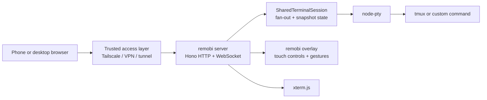
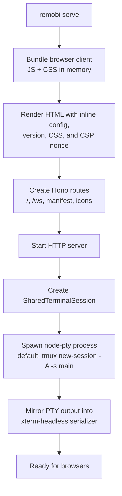

# How remobi works

remobi is a small web terminal stack tuned for phone-sized control of an existing terminal workflow. The server runs a single local PTY-backed command, the browser renders that terminal with `xterm.js`, and the remobi overlay adds the mobile controls on top.

This page is the high-level view. For the transport, message protocol, and request lifecycle, see [Networking and WebSocket flow](networking-and-websockets.md).

## System view

## Main pieces

| Piece | Role |
| --- | --- |
| Browser client | Loads the HTML shell, boots `xterm.js`, opens `/ws`, and renders terminal output |
| remobi overlay | Adds toolbar, drawer, gestures, reconnect handling, and mobile viewport behaviour |
| Hono server | Serves `/`, `/ws`, and optional PWA assets with security headers |
| `SharedTerminalSession` | Owns the PTY, mirrors terminal state, and fans output out to every browser client |
| `node-pty` | Spawns the local command and bridges raw terminal I/O |
| tmux or custom command | The actual program remobi exposes |

## Runtime boot path

`remobi serve` owns the whole path now. It does not launch `ttyd` or patch someone else's HTML.

## What is shared vs per-browser

- The PTY session is shared. Multiple browsers can attach to the same terminal session.
- Terminal output is broadcast to all connected clients.
- Each newly connected browser receives a serialized snapshot first, then live output.
- The overlay state is local to each browser. Font size, focus, reconnect UI, and viewport handling stay in the client.

## Where the code lives

| Area | Notes |
| --- | --- |
| `src/serve.ts` | HTTP server, WebSocket upgrade, headers, origin checks, shutdown |
| `src/session.ts` | PTY lifecycle, state mirroring, snapshots, fan-out to clients |
| `src/session-protocol.ts` | JSON message types and bounds checks |
| `src/client-entry.ts` | Browser bootstrap, `xterm.js`, WebSocket client, snapshot/output handling |
| `src/index.ts` | Overlay initialisation on top of the terminal instance |

## Why the snapshot layer exists

The browser does not become the source of truth for terminal state. `SharedTerminalSession` keeps a headless xterm mirror on the server so a newly attached browser can be brought up to date before live output resumes.

That gives remobi two useful properties:

- opening the same session from another device does not start a second shell
- reconnecting clients can rebuild the visible terminal without the PTY needing to replay history itself

## Terminal agnosticism

The PTY bridge is terminal-agnostic. `SharedTerminalSession`, the WebSocket protocol, and the browser client have no knowledge of tmux. tmux awareness lives only in config defaults (buttons, gestures, `DEFAULT_COMMAND`) and generic config like `postSpawnCommand`. This separation means remobi works with any command — `bash`, `zsh`, `fish`, `python` — not just tmux.
