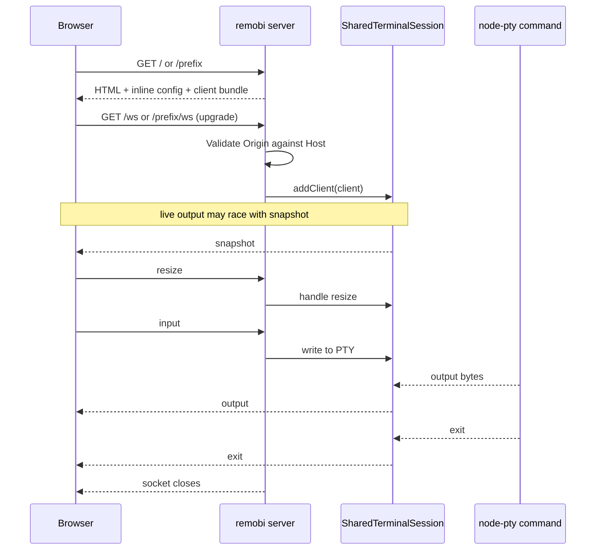

# Networking and WebSocket flow

This page explains how a browser reaches remobi, how the WebSocket transport works, and how the shared terminal session stays in sync across clients.

For the high-level runtime layout, see [How remobi works](how-remobi-works.md).

## Network boundary

remobi is intentionally simple at the network edge:

- `remobi serve` binds to `127.0.0.1` by default
- there is no built-in auth layer
- the recommended deployment model is localhost remobi behind Tailscale Serve, a VPN, or another trusted tunnel
- using `--host 0.0.0.0` deliberately exposes terminal control beyond loopback

The browser talks to two server entry points:

- `GET /` for the HTML document with inline JS, CSS, config, and CSP nonce
- `GET /ws` for the terminal WebSocket

When `remobi serve --base-path /prefix` is used, remobi also serves the same HTML, WebSocket, manifest, and icon routes under `/prefix/...`. Root routes stay available for direct local access.

## Browser-to-session sequence

## Message protocol

The WebSocket payloads are JSON strings. remobi validates both shape and size before acting on them.

### Browser -> server

| Type | Purpose |
| --- | --- |
| `input` | Raw terminal input bytes to write into the PTY |
| `resize` | Updated terminal `cols` and `rows` after fit/viewport changes |
| `ping` | Lightweight liveness probe |

### Server -> browser

| Type | Purpose |
| --- | --- |
| `snapshot` | Serialized current terminal screen for first attach |
| `output` | Live PTY output stream |
| `exit` | PTY exit code and signal |
| `error` | Protocol or session attach error |
| `pong` | Response to `ping` |

Important current limits from `src/session-protocol.ts`:

- max client message bytes: `256 KiB`
- max input bytes per message: `256 KiB`
- max resize: `500` cols, `200` rows

These message shapes are implementation details, not a supported public API.

## Session sync model

When a client attaches, the server does not wait for fresh PTY output to rebuild the screen. Instead:

1. `SharedTerminalSession` keeps a headless xterm mirror of the PTY output.
2. The client is added to the live broadcast set before the snapshot work completes.
3. A serialized snapshot of the mirror is sent as soon as it is ready.
4. Live `output` can arrive before that snapshot, so the browser buffers pre-snapshot output until the snapshot has been applied.

That is why the browser client has both snapshot handling and pending-output buffering during attach.

## Security and browser constraints

The current server behaviour matters for docs because remobi is usually deployed behind another network layer:

- `/ws` upgrades, including prefixed variants such as `/prefix/ws`, are gated by an Origin check against the request Host header
- when no Origin is sent, loopback hosts are the only implicit allow case
- CSP `connect-src` is scoped to the request authority, including explicit `ws://` and `wss://` entries for Safari compatibility
- security headers are applied to both HTML and WebSocket-adjacent responses

## Client-side connection behaviour

The browser opens exactly one terminal socket to `${location.host}${basePath}/ws`, where `basePath` is `/` by default and can be overridden with `--base-path`.

- before the socket opens, outbound messages are queued locally
- on open, the client sends a resize based on the fitted terminal size, then flushes queued messages
- inbound `output` can arrive before `snapshot`, so the client buffers that output until the snapshot has been written
- if reconnect UI is enabled, remobi can show a reconnect overlay when the socket closes or errors
- if reconnect UI is disabled, the browser shows a simple session-ended or connection-lost overlay with a reload button
